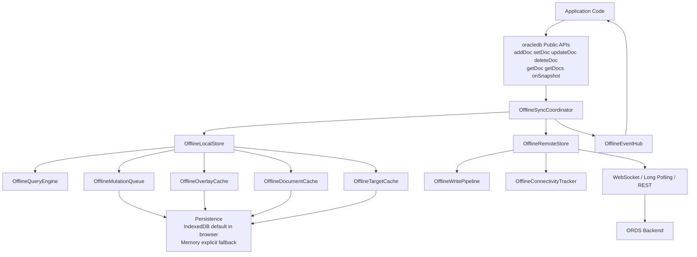
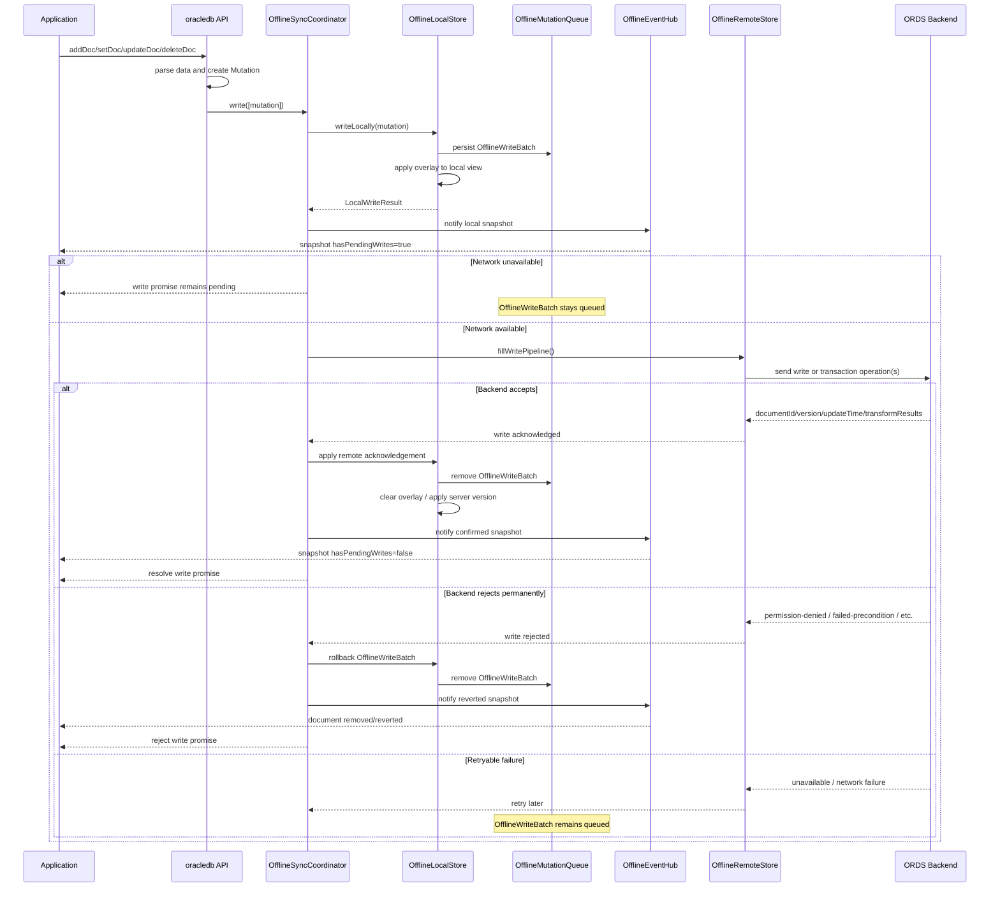
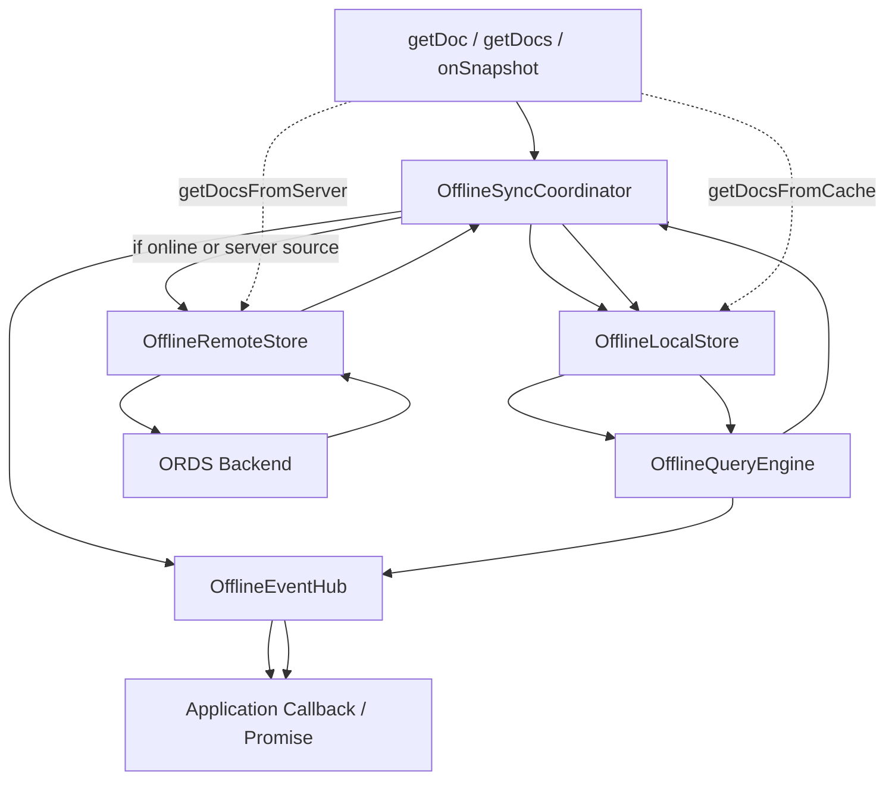

# OracleDB Offline Support Design

## Goal

Add offline capabilities to the modular `fusabase/oracledb` service.

The SDK should support:

- Local cached reads.
- Offline write queueing.
- Optimistic local writes.
- Listener updates from local state before server acknowledgement.
- Retry and replay when the network returns.
- Rollback when the backend rejects a pending write.
- Snapshot metadata that lets applications distinguish local/pending data from server-confirmed data.

This design applies to the OracleDB service only. App, Auth, Storage, UI, and App Trust should remain modular and should not be imported by OracleDB unless explicitly needed.

## Design Principles

1. Public APIs should stay thin.

   APIs such as `addDoc`, `setDoc`, `updateDoc`, `deleteDoc`, `getDoc`, `getDocs`, and `onSnapshot` should not directly implement offline behavior. They should parse user input, create references/mutations, and delegate to internal engines.

2. Offline behavior should be centralized.

   A `OfflineSyncCoordinator` should coordinate local persistence, pending writes, listeners, and remote sync.

3. Local writes are optimistic, not authoritative.

   The SDK may show a local write immediately, but the write is only durable after the backend confirms it.

4. Backend rejection must rollback local state.

   If ORDS rejects a write because of security rules, preconditions, validation, or permission errors, the SDK must remove or revert the optimistic local change.

5. Metadata must expose pending state.

   Applications must be able to detect data that is local or pending server acknowledgement.

## High-Level Architecture



## Offline Write Request Flow



## Offline Read And Listener Flow



## Required Public APIs

### Persistence APIs

```ts
enableOffline(db: Oracledb, options?: OfflineOptions): Promise<void>;
enableIndexedDbPersistence(db: Oracledb): Promise<void>;
enableMemoryPersistence(db: Oracledb): Promise<void>;
clearIndexedDbPersistence(db: Oracledb): Promise<void>;
```

`enableOffline` enables offline support. In browser environments, it should use IndexedDB by default.

`enableIndexedDbPersistence` enables durable browser persistence.

`enableMemoryPersistence` enables offline behavior only for the current runtime session.

`clearIndexedDbPersistence` clears local cached documents, pending query metadata, and persisted mutation state. It should fail if the `Oracledb` instance is currently running.

Recommended options:

```ts
type OfflineOptions = {
  persistence?: "indexeddb" | "memory";
  synchronizeTabs?: boolean;
};
```

Default behavior:

- Browser with IndexedDB available: use IndexedDB.
- Browser without IndexedDB or blocked storage: fail with a clear error unless memory persistence is explicitly requested.
- Node/non-browser: use memory persistence only when explicitly configured.
- Tests and temporary sessions: use `persistence: "memory"`.

### Network APIs

```ts
enableNetwork(db: Oracledb): Promise<void>;
disableNetwork(db: Oracledb): Promise<void>;
```

`disableNetwork` stops remote reads/listens/writes but keeps local reads and local writes enabled.

`enableNetwork` resumes pending write replay and remote query/listener refresh.

### Read Source APIs

```ts
getDocFromCache(ref: DocumentReference): Promise<DocumentSnapshot>;
getDocsFromCache(query: Query): Promise<QuerySnapshot>;
getDocFromServer(ref: DocumentReference): Promise<DocumentSnapshot>;
getDocsFromServer(query: Query): Promise<QuerySnapshot>;
```

### Offline-Safe `addDoc` API

Offline `addDoc` requires a known document ID before the local mutation is created.

Recommended overload:

```ts
addDoc(collectionRef, data);
addDoc(collectionRef, id, data);
```

Alternative options-based shape:

```ts
addDoc(collectionRef, data, { id: "city-sf" });
```

When an ID is provided, `addDoc` can internally create a document reference and route through the same mutation path as `setDoc`:

```ts
const ref = doc(collectionRef, id);
await setDoc(ref, data);
return ref;
```

If `addDoc(collectionRef, data)` keeps using server-generated IDs, it should only be supported online. While offline, it should reject with a clear error unless an ID is provided.

Default APIs should remain:

```ts
getDoc(ref);
getDocs(query);
```

Recommended behavior:

- `getDoc` / `getDocs`: try server when online, update cache, fall back to cache when offline if available.
- `getDocFromCache` / `getDocsFromCache`: only read local cache.
- `getDocFromServer` / `getDocsFromServer`: only use server and reject when offline.

### Listener Options

```ts
onSnapshot(refOrQuery, { includeMetadataChanges: true }, callback);
```

When `includeMetadataChanges` is true, listeners should fire when only metadata changes, such as `hasPendingWrites` flipping from `true` to `false`.

### Snapshot Metadata

Document and query snapshots should expose:

```ts
snapshot.metadata.fromCache;
snapshot.metadata.hasPendingWrites;
```

Document snapshots should expose:

```ts
docSnap.metadata.fromCache;
docSnap.metadata.hasPendingWrites;
```

Meaning:

- `fromCache === true`: data came from local cache and may not reflect the latest server state.
- `hasPendingWrites === true`: snapshot includes local writes not yet confirmed by the backend.

## New Internal Components

### Local Persistence

Directory:

```txt
packages/oracledb/src/local/
```

Components:

- `OfflineLocalStore`
- `OfflineIndexedDbPersistence`
- `OfflineMemoryPersistence`
- `OfflineMutationQueue`
- `OfflineDocumentCache`
- `OfflineTargetCache`
- `OfflineOverlayCache`

Responsibilities:

- Store cached remote documents.
- Store pending mutation batches.
- Store overlays for optimistic local writes.
- Store active query target metadata.
- Serve document and query reads from local cache.
- Recompute local views after writes, acknowledgements, and rejections.

### Mutation Model

Directory:

```txt
packages/oracledb/src/model/
```

Types:

- `OracledbDocumentKey`
- `OracledbDocumentVersion`
- `OracledbSnapshotVersion`
- `OracledbWritePrecondition`
- `OfflineWriteMutation`
- `OfflineSetWrite`
- `OfflinePatchWrite`
- `OfflineDeleteWrite`
- `OfflineTransformWrite`
- `OfflineWriteBatch`
- `OfflineWriteResult`

The mutation model should represent user writes independently from REST request shape. REST serialization should happen later in `OfflineRemoteStore`.

### Sync Engine

Directory:

```txt
packages/oracledb/src/core/sync_engine.ts
```

Responsibilities:

- Accept user writes from public APIs.
- Write mutations locally.
- Notify listeners immediately.
- Start remote send for pending writes.
- Apply successful write acknowledgements.
- Roll back rejected writes.
- Coordinate local reads, server reads, and listener state.

Core methods:

```ts
syncEngine.write(mutations): Promise<void>;
syncEngine.listen(query, options, observer): Unsubscribe;
syncEngine.getDocument(ref, source): Promise<DocumentSnapshot>;
syncEngine.getDocuments(query, source): Promise<QuerySnapshot>;
syncEngine.enableNetwork(): Promise<void>;
syncEngine.disableNetwork(): Promise<void>;
```

### Remote Store

Directory:

```txt
packages/oracledb/src/remote/
```

Components:

- `OfflineRemoteStore`
- `OfflineWritePipeline`
- `OfflineConnectivityTracker`
- `OfflineOracledbSerializer`
- `Backoff`
- `WatchStream`
- `LongPollingListenStream`

Responsibilities:

- Serialize mutation batches into ORDS API requests.
- Send pending writes.
- Retry retryable failures with backoff.
- Classify backend errors as retryable or permanent.
- Apply write success responses.
- Notify `OfflineSyncCoordinator` about success or rejection.
- Refresh listened queries when online.
- Use WebSocket when socket mode is enabled.
- Use long polling when socket mode is disabled or unavailable.

### Event Manager

Directory:

```txt
packages/oracledb/src/core/event_manager.ts
```

Responsibilities:

- Track active `onSnapshot` listeners.
- Fan out local cache changes.
- Fan out remote cache changes.
- Decide whether metadata-only changes should fire.
- Build public `DocumentSnapshot` and `QuerySnapshot` objects with metadata.

### Query Engine

Directory:

```txt
packages/oracledb/src/local/query_engine.ts
```

Responsibilities:

- Execute document and collection queries against local cache.
- Apply local overlays.
- Mark query results as complete or incomplete.
- Return `fromCache` state.
- Decide whether server fetch is needed.

### Network State Manager

Directory:

```txt
packages/oracledb/src/remote/connectivity_monitor.ts
```

Responsibilities:

- Track browser online/offline events.
- Track explicit `disableNetwork` / `enableNetwork`.
- Notify `OfflineRemoteStore` when network state changes.

## Local Data Model

### Cached Document

```ts
type CachedDocument = {
  key: string;
  data: Record<string, unknown>;
  version: string;
  updateTime?: string;
  readTime?: string;
  hasLocalMutations: boolean;
  hasCommittedMutations: boolean;
};
```

### Mutation Batch

```ts
type StoredOfflineWriteBatch = {
  batchId: number;
  localWriteTime: number;
  mutations: Mutation[];
  baseMutations: Mutation[];
  affectedKeys: string[];
};
```

### Query Target

```ts
type QueryTarget = {
  targetId: number;
  canonicalQuery: string;
  lastListenSequenceNumber: number;
  snapshotVersion?: string;
  resumeToken?: string;
};
```

For the first implementation, `resumeToken` can be omitted if ORDS does not support watch resume tokens.

The SDK already supports both WebSocket and long polling transports. Offline listener recovery should build on those existing transports:

- WebSocket for realtime watch/listen when available.
- Long polling for environments where sockets are disabled or unavailable.
- Full query refetch on reconnect if resume tokens are unavailable.
- Resume from token/version if ORDS exposes resume metadata later.

## Backend Response Requirements

Each ORDS write/update API currently returns:

```ts
{
  documentId: string;
  version: string;
}
```

This is enough for a first offline write queue if:

- Offline `addDoc` uses a known document ID before the local mutation is created.
- Backend errors are clearly classified.
- Server transforms are either unsupported offline or deterministic locally.

Recommended expanded response:

```ts
{
  documentId: string;
  version: string;
  updateTime: string;
  commitTime: string;
  transformResults?: unknown[];
  writeResults?: Array<{
    documentId: string;
    version: string;
    updateTime: string;
  }>;
}
```

### `documentId`

Identifies the document accepted by the backend.

For offline `addDoc`, the SDK must know the document ID before sending. That ID can be user-provided, SDK-generated, or supplied through `doc(collectionRef, id)` followed by `setDoc`.

Server-generated IDs are not offline-safe because the SDK cannot know the final document path while offline. Supporting server-generated IDs offline would require temporary local IDs and later remapping.

### `version`

Server-confirmed document version.

Use it to:

- replace local pending version
- support conflict detection
- support update preconditions
- mark cached document as server-confirmed

### `updateTime`

Server timestamp/version for the individual document after the write.

Use it to:

- order document changes
- store server-confirmed update metadata
- support stale-write checks
- expose debug/metadata state if needed

### `commitTime`

Server timestamp/version for the whole commit operation.

Use it to:

- order write batches
- assign a consistent commit point to all writes in one batch
- reconcile query/listener snapshots

For a single-document write, `commitTime` and `updateTime` may be similar. For batch writes, `commitTime` is the shared commit marker.

### `transformResults`

Server-computed final values for field transforms.

Needed for:

- `serverTimestamp()`
- `increment()`
- `arrayUnion()`
- `arrayRemove()`
- future vector/server transforms

Example:

```ts
await updateDoc(ref, {
  count: increment(1),
  updatedAt: serverTimestamp()
});
```

The SDK may apply a local estimate, but the server result is authoritative. `transformResults` lets the SDK replace local estimates with final values.

The SDK should follow transform handling:

- Store field transforms separately from normal document data in the mutation.
- Apply local transform estimates for optimistic/offline views.
- Reconcile local estimates with backend `transformResults` after acknowledgement.
- Require `transformResults` for non-array transforms such as `serverTimestamp()` and `increment()`.
- Allow array transforms to be recomputed locally on acknowledgement only if ORDS guarantees identical `arrayUnion()` and `arrayRemove()` semantics. Otherwise ORDS should return final array transform results too.

Pending `serverTimestamp()` values should preserve:

- local write time
- previous field value

Public snapshot reads should support unresolved server timestamp behavior:

```ts
docSnap.data({ serverTimestamps: "estimate" });
docSnap.data({ serverTimestamps: "previous" });
docSnap.data({ serverTimestamps: "none" });
```

Meaning:

- `"estimate"` returns the local write time.
- `"previous"` returns the previous field value.
- `"none"` returns `null`.

### `writeResults`

Per-document results for batch writes and transactions.

Needed for:

- clearing pending state per document
- assigning versions per document
- applying transform results to the correct mutation
- reconciling batch commits accurately

Current ORDS batch writes use a transaction-style flow:

- create a transaction ID
- send each write operation as a normal HTTP write under that transaction ID
- receive `documentId` and `version` per operation call
- call commit or abort

The per-operation versions should be treated as provisional until the final transaction commit succeeds. The SDK should collect them during replay but must not mark local writes as server-confirmed until commit succeeds.

## Backend Error Requirements

ORDS APIs should return structured error codes:

```ts
{
  code:
    | "permission-denied"
    | "not-found"
    | "already-exists"
    | "failed-precondition"
    | "invalid-argument"
    | "unauthenticated"
    | "unavailable"
    | "deadline-exceeded"
    | "internal";
  message: string;
}
```

Permanent errors should reject and rollback:

- `permission-denied`
- `not-found`
- `already-exists`
- `failed-precondition`
- `invalid-argument`
- `unauthenticated`

Retryable errors should remain queued:

- `unavailable`
- `deadline-exceeded`
- transient network failure
- selected `internal` failures if known retryable

## Request Flow: `addDoc`

Current flow is roughly:

```txt
addDoc()
  -> build REST request
  -> send to ORDS
  -> return backend result
```

Offline-capable flow:

```txt
addDoc(collectionRef, id, data)
  -> create DocumentReference from user-provided ID
  -> apply converter
  -> parse and validate user data
  -> create OfflineSetWrite with OracledbWritePrecondition.exists(false)
  -> OfflineSyncCoordinator.write([mutation])
  -> OfflineLocalStore.writeLocally()
  -> persist mutation batch in OfflineMutationQueue
  -> apply overlay to local document view
  -> OfflineEventHub emits local snapshot
       fromCache=true/false depending current target state
       hasPendingWrites=true
  -> OfflineRemoteStore attempts to send pending batch
  -> if online and backend accepts:
       receive documentId/version/updateTime/commitTime
       remove batch from OfflineMutationQueue
       apply server version to OfflineDocumentCache
       clear overlay for this mutation
       OfflineEventHub emits confirmed snapshot
         hasPendingWrites=false
       resolve addDoc promise with docRef
  -> if online and backend rejects permanently:
       remove batch from OfflineMutationQueue
       rollback overlay
       OfflineEventHub emits reverted snapshot
       reject addDoc promise
  -> if offline or retryable failure:
       keep batch queued
       keep local optimistic view
       keep addDoc promise pending
```

Recommended promise behavior:

- Listener updates happen immediately from local state.
- The write promise resolves only after backend success.
- If offline, the promise remains pending until the write is acknowledged.
- If backend rejects, the promise rejects and local state is rolled back.

If `addDoc(collectionRef, data)` has no known ID and relies on server-generated IDs, it should not enter the offline write queue. It should either:

- run only when online, or
- reject while offline with an error telling the caller to provide an ID or use `setDoc(doc(collectionRef, id), data)`.

## Request Flow: `setDoc`

```txt
setDoc(docRef, data, options?)
  -> parse data
  -> create OfflineSetWrite or OfflinePatchWrite
  -> OfflineSyncCoordinator.write([mutation])
  -> same local/remote flow as addDoc
```

If merge options are used, the mutation should include a field mask.

## Request Flow: `updateDoc`

```txt
updateDoc(docRef, data)
  -> parse update paths and values
  -> create OfflinePatchWrite with OracledbWritePrecondition.exists(true)
  -> OfflineSyncCoordinator.write([mutation])
```

If the backend later reports `not-found` or `failed-precondition`, rollback the local update.

## Request Flow: `deleteDoc`

```txt
deleteDoc(docRef)
  -> create OfflineDeleteWrite
  -> OfflineSyncCoordinator.write([mutation])
  -> local cache marks document deleted with pending write
  -> listener removes document with hasPendingWrites=true
  -> backend success confirms deletion
  -> backend rejection restores previous cached document
```

## Request Flow: Batch Writes

Current ORDS batch writes use transaction flow, while each write operation remains the same shape as a normal write operation.

Offline-capable flow:

```txt
batch.commit()
  -> store one local OfflineWriteBatch
  -> apply all mutations optimistically
  -> mark affected documents hasPendingWrites=true
  -> when online:
       create ORDS transaction ID
       send operation 1 as normal write with transaction ID
         collect provisional { documentId, version }
       send operation 2 as normal write with transaction ID
         collect provisional { documentId, version }
       ...
       if all operation calls succeed:
         call commit(transactionId)
       if commit succeeds:
         apply collected versions to local cache
         clear hasPendingWrites for affected documents
         resolve batch.commit()
       if any operation or commit permanently fails:
         call abort(transactionId) if transaction exists
         rollback entire local OfflineWriteBatch
         reject batch.commit()
       if network or retryable failure occurs:
         keep entire OfflineWriteBatch queued
```

Important rule:

Even though ORDS returns versions per operation before commit, the SDK should not treat those writes as server-confirmed until the final commit succeeds.

## Request Flow: `getDoc`

```txt
getDoc(ref)
  -> if source is cache:
       read OfflineLocalStore only
  -> if source is server:
       fetch server only, update OfflineLocalStore, return server snapshot
  -> default:
       if online:
         fetch server, update OfflineLocalStore, return server snapshot
       if offline:
         return cached snapshot if available
         otherwise return missing snapshot or reject based on chosen semantics
```

Recommended:

- `getDocFromCache` returns cache or missing cached snapshot.
- `getDocFromServer` rejects when offline.
- `getDoc` falls back to cache when offline.

## Request Flow: `getDocs`

```txt
getDocs(query)
  -> OfflineQueryEngine checks local cache
  -> if source is cache:
       return local result with fromCache=true
  -> if source is server:
       fetch server result
       update OfflineLocalStore
       return fromCache=false
  -> default:
       if online:
         fetch server and update cache
       if offline:
         return local result with fromCache=true
```

Query completeness matters. If the SDK cannot prove that the local cache contains a complete result for the query, `fromCache` should be `true`.

Default `getDocs()` may return cached results while offline even if completeness cannot be proven. Applications that require exact server truth should call `getDocsFromServer()`. Applications that explicitly want local data should call `getDocsFromCache()`.

## Request Flow: `onSnapshot`

```txt
onSnapshot(refOrQuery, options, callback)
  -> OfflineEventHub registers listener
  -> OfflineQueryEngine computes initial local view
  -> callback receives cached/local snapshot if available
  -> OfflineRemoteStore starts listen or polling refresh if network enabled
  -> remote result updates OfflineLocalStore
  -> OfflineEventHub emits updated snapshot
  -> local writes also update OfflineLocalStore overlays
  -> OfflineEventHub emits optimistic snapshot
  -> backend success/rejection emits metadata/data correction snapshot
```

If `includeMetadataChanges` is false, metadata-only changes may be suppressed.

If `includeMetadataChanges` is true, listeners should receive events when:

- `hasPendingWrites` changes
- `fromCache` changes
- network state changes cause a cached result to become server-confirmed

## Security Rules And Optimistic Writes

The SDK cannot evaluate backend security rules locally.

This means:

1. The customer may see a local write immediately.
2. That local write may later be rejected by the backend.
3. The SDK must rollback the local write.
4. Applications should use `hasPendingWrites` to show saving/pending UI.

Example UI behavior:

```ts
onSnapshot(queryRef, { includeMetadataChanges: true }, snapshot => {
  for (const doc of snapshot.docs) {
    const pending = doc.metadata.hasPendingWrites;
    renderRow(doc.data(), { pending });
  }
});
```

## Multi-Tab Support

Initial implementation can support single-tab persistence only.

Later multi-tab support should add:

- primary tab election
- shared mutation queue ownership
- BroadcastChannel or IndexedDB lease coordination
- secondary tabs reading cache but not sending duplicate writes

Recommended APIs:

```ts
enableIndexedDbPersistence(db, { synchronizeTabs: true });
```

## Garbage Collection

Local persistence needs cleanup.

Initial implementation:

- no automatic GC or size-limited simple cleanup

Later implementation:

- LRU sequence numbers
- remove documents not pinned by active targets
- keep documents with pending mutations
- configurable cache size

Potential API:

```ts
persistentLocalCache({
  cacheSizeBytes: 40 * 1024 * 1024
});
```

## Implementation Phases

### Phase 1: Define Offline Architecture Skeleton

Deliver:

- directory structure under `packages/oracledb/src/local`
- directory structure under `packages/oracledb/src/model`
- directory structure under `packages/oracledb/src/core`
- directory structure under `packages/oracledb/src/remote`
- class and interface definitions
- public API stubs
- method contracts and expected return types
- no behavior changes to existing online request flow

Classes/interfaces to define:

- `OfflineLocalStore`
- `OfflineMemoryPersistence`
- `OfflineIndexedDbPersistence`
- `OfflineDocumentCache`
- `OfflineMutationQueue`
- `OfflineOverlayCache`
- `OfflineTargetCache`
- `OfflineQueryEngine`
- `OfflineSyncCoordinator`
- `OfflineEventHub`
- `OfflineRemoteStore`
- `OfflineWritePipeline`
- `OfflineConnectivityTracker`
- `OfflineWriteMutation`
- `OfflineSetWrite`
- `OfflinePatchWrite`
- `OfflineDeleteWrite`
- `OfflineTransformWrite`
- `OfflineWriteBatch`
- `OfflineWriteResult`
- `OracledbWritePrecondition`
- `OracledbDocumentKey`
- `OracledbDocumentVersion`
- `OracledbSnapshotVersion`

Public API stubs:

- `enableOffline`
- `enableIndexedDbPersistence`
- `enableMemoryPersistence`
- `clearIndexedDbPersistence`
- `enableNetwork`
- `disableNetwork`
- `getDocFromCache`
- `getDocsFromCache`
- `getDocFromServer`
- `getDocsFromServer`

No offline behavior yet. Phase 1 should compile and preserve current behavior.

### Phase 2: Local Cache Reads

Deliver:

- working `OfflineMemoryPersistence`
- working `OfflineIndexedDbPersistence`
- working `OfflineDocumentCache`
- `getDocFromCache`
- `getDocsFromCache`
- server reads update local cache
- default `getDoc` and `getDocs` can fall back to cache when offline

No offline writes yet.

Current Phase 2 progress:

- `enableOffline`, `enableIndexedDbPersistence`, and `enableMemoryPersistence` initialize offline state.
- `OfflineMemoryPersistence` stores cached documents in memory.
- `OfflineIndexedDbPersistence` stores cached documents in IndexedDB and loads them into the local cache map on startup.
- `OfflineDocumentCache` can store, retrieve, and remove documents.
- `OfflineQueryEngine` can reconstruct `DocumentSnapshot` from cache.
- `OfflineQueryEngine` can reconstruct collection `QuerySnapshot` results from cache and apply simple `where`, cursor-derived field conditions, `orderBy`, and `limit` constraints.
- `getDocFromCache` and `getDocsFromCache` are wired to the local cache.
- `getDoc`, `getDocFromServer`, `getDocs`, and `getDocsFromServer` populate the cache after successful server reads when offline is enabled.
- Default `getDoc` and `getDocs` use the cache when offline support is enabled and the SDK network is disabled or the browser reports offline.
- Explicit server reads reject when SDK network is disabled or the browser reports offline.

Remaining Phase 2 limitations:

- cache query reads do not support joins, aggregates, vector search, or composite filters yet
- default `getDocs` cannot reliably fall back on all server failures because the current collection `get()` path catches some transport errors and returns an empty server snapshot
- cache miss behavior like for documents: missing cache returns a missing cached snapshot; incomplete query cache returns available cached rows with `fromCache=true`

### Phase 3: Offline Write Queue

Deliver:

- mutation model
- `OfflineMutationQueue`
- `OfflineLocalStore.writeLocally`
- optimistic local overlays
- queued write replay on reconnect
- rollback on permanent backend rejection

Support:

- `addDoc`
- `setDoc`
- `updateDoc`
- `deleteDoc`

Current Phase 3 progress:

- `OfflineMutationQueue` stores ordered mutation batches in memory and IndexedDB persistence.
- `OfflineLocalStore.writeLocally` creates a batch, persists it, and applies optimistic local cache state with `hasLocalMutations=true`.
- `deleteDoc` queues a local delete while SDK network is disabled or the browser reports offline.
- `setDoc` queues a local set or patch while SDK network is disabled or the browser reports offline.
- `updateDoc` queues a local patch with an `exists(true)` precondition while SDK network is disabled or the browser reports offline.
- `addDoc(collectionRef, id, data)` queues a local create with an `exists(false)` precondition while SDK network is disabled or the browser reports offline.
- `addDoc(collectionRef, data)` rejects offline because no final document ID is known.
- `OfflineRemoteStore` replays queued batches when `enableNetwork` is called or the browser fires an `online` event.
- Current-runtime write promises resolve when replay succeeds and reject when replay gets a permanent backend error.
- Retryable failures leave batches queued.
- Permanent failures rollback optimistic cache state using stored pre-write document snapshots.
- Successful replay removes mutation batches and clears local pending state.

Remaining Phase 3 limitations:

- create-only `exists(false)` replay is guarded client-side before sending because the current ORDS set API does not expose a durable create precondition in the SDK helper path
- write promises from previous page/runtime sessions cannot be resolved after reload, but their persisted batches still replay and update local cache state

### Phase 4: Snapshot Metadata

Deliver:

- `SnapshotMetadata`
- `fromCache`
- `hasPendingWrites`
- metadata propagation to document and query snapshots

Current Phase 4 progress:

- Cache reads construct `DocumentSnapshot` and `QuerySnapshot` with `fromCache=true`.
- Cached documents with local queued mutations set `hasPendingWrites=true`.
- Query snapshots aggregate `hasPendingWrites=true` when any returned cached document has local mutations.
- Server-read cache population skips documents with pending local writes, so optimistic metadata is not cleared before acknowledgement.
- Default `getDoc` and `getDocs` return pending cached snapshots when local queued writes exist for the requested document/query.
- Successful replay clears pending state; permanent rejection rolls back to the pre-write cached document state.

### Phase 5: Listener Integration

Deliver:

- `OfflineEventHub`
- local listener events
- metadata-only events
- remote refresh integration
- rollback listener events

Current Phase 5 progress:

- `OfflineEventHub` registers cache-backed document, collection, and query listeners.
- Offline listeners emit an initial cached snapshot.
- Local queued writes emit optimistic snapshots to affected listeners.
- Replay acknowledgement emits confirmed metadata/data snapshots to affected listeners.
- Permanent replay rejection emits rollback snapshots to affected listeners.
- Metadata-only changes are suppressed by default and emitted when `includeMetadataChanges` is true.
- Public `onSnapshot` uses the offline event hub for normal document/query/collection refs when offline support is enabled.

Remaining Phase 5 limitations:

- Offline listener registration is cache-backed; it does not yet combine cache events with the existing WebSocket/long-poll remote listener stream in a single listener.
- Duality view listeners keep using the existing online listener path.

### Phase 6: Network Controls

Deliver:

- `enableNetwork`
- `disableNetwork`
- browser connectivity monitor
- retry/backoff

Current Phase 6 progress:

- `OfflineConnectivityTracker` monitors browser `online` and `offline` events.
- Browser offline pauses remote replay and emits cache-backed listener snapshots.
- Browser online resumes queued write replay when SDK network is enabled.
- `disableNetwork` pauses replay, cancels retry timers, and emits cache-backed listener snapshots.
- `enableNetwork` resumes replay when browser connectivity is online and emits cache-backed listener snapshots.
- Retryable replay failures stay queued and schedule exponential backoff retries.
- Successful replay resets retry backoff.

### Phase 7: Batch Writes And Transactions

Deliver:

- per-write mutation results
- `writeResults` handling
- batch-level `commitTime`
- transaction retry behavior

Current Phase 7 progress:

- Offline `WriteBatch.commit()` stores all batch operations as one `OfflineWriteBatch`.
- Batched `set`, `update`, and `delete` operations apply optimistically together in local cache.
- Replay sends all mutations in a queued batch under one ORDS transaction name.
- Replay marks only the final mutation with `end=1`, matching the existing ORDS transaction-style flow.
- Batch replay acknowledgement clears pending local state for all affected documents together.
- Permanent replay rejection rolls back the whole local batch using stored pre-write document snapshots.
- Retryable replay failures keep the whole batch queued.

Remaining Phase 7 limitations:

- ORDS commit responses do not yet expose a shared `commitTime`, so the SDK clears pending state after final operation success without a true batch commit marker.
- Offline `runTransaction` with reads is not implemented; transaction reads still require server access.
- Per-write `writeResults` are collected from existing operation responses when available, but transform result reconciliation remains future work.

### Phase 8: Multi-Tab And Garbage Collection

Deliver:

- primary tab election
- synchronized tabs
- LRU garbage collection
- cache size configuration

Current Phase 8 progress:

- `OfflineTabCoordinator` elects a primary tab when `synchronizeTabs` is enabled.
- Only the primary tab runs remote replay; secondary tabs keep cache reads/listeners and can persist queued mutations.
- Primary-tab lease uses browser `localStorage` with heartbeat renewal and expiry.
- Cached documents carry sequence numbers for LRU cleanup.
- Memory and IndexedDB persistence support configurable `cacheSizeBytes`.
- LRU cleanup evicts oldest non-pending cached documents first and preserves documents with pending local mutations.
- `persistentLocalCache({ cacheSizeBytes })` returns IndexedDB offline options with a cache size limit.

Remaining Phase 8 limitations:

- Secondary tabs do not yet receive active cross-tab cache change broadcasts; they observe changes after local reads/reload.
- Lease coordination is localStorage-based rather than IndexedDB transaction leasing.
- Garbage collection is size-based only and does not yet pin active query targets.

## SDK Hardening Still Needed

These items remain after the phased implementation work and do not require backend contract changes.

### Test Coverage

Add focused tests for:

- cache reads
- `getDoc` and `getDocs` offline fallback
- queued `setDoc`, `updateDoc`, `deleteDoc`, and known-ID `addDoc`
- replay success
- retryable failure staying queued
- permanent failure rollback
- listener optimistic, acknowledgement, and rollback events
- `enableNetwork` and `disableNetwork`
- offline `WriteBatch.commit`
- IndexedDB persistence reload
- cache garbage collection
- multi-tab primary lease behavior

### Transform Reconciliation

Remaining SDK work:

- apply local estimates for `serverTimestamp()` and `increment()`
- replace local estimates when replay succeeds
- preserve previous timestamp values for `serverTimestamps: "previous"`
- complete array transform reconciliation for `arrayUnion()` and `arrayRemove()`

### Listener Integration

Remaining SDK work:

- merge offline cache events with the existing WebSocket and long-poll server listener paths
- avoid replacing online listener behavior when offline is enabled
- support metadata-only server/cache transitions more completely

### Cross-Tab Behavior

Remaining SDK work:

- broadcast cache and mutation changes to secondary tabs
- refresh secondary-tab listeners when the primary tab replays writes
- consider IndexedDB lease coordination instead of `localStorage` lease coordination

### Garbage Collection

Remaining SDK work:

- pin active listener and query targets
- avoid evicting documents needed for active queries
- replace JSON-length size estimates with more accurate accounting

### Public API And Type Polish

Remaining SDK work:

- update manually maintained source `.d.ts` files for all new offline APIs
- add API docs and examples for `enableOffline`, cache reads, network controls, and `persistentLocalCache`
- verify new exports

### Replay Hardening

Remaining SDK work:

- handle auth or token changes while writes are queued
- handle app deletion while replay is pending
- harden partial transaction failure cleanup
- prevent duplicate replay across tabs
- handle stale cache state after long offline periods

## Minimum Viable Backend Contract

For Phase 2, each single-document write API needs:

```ts
{
  documentId: string;
  version: string;
}
```

And structured errors that distinguish permanent rejection from retryable failures.

Recommended Phase 2+ contract:

```ts
{
  documentId: string;
  version: string;
  updateTime: string;
  commitTime: string;
  transformResults?: unknown[];
}
```

For batch writes:

```ts
{
  commitTime: string;
  writeResults: Array<{
    documentId: string;
    version: string;
    updateTime: string;
  }>;
}
```

With the current ORDS transaction flow, the SDK can collect `writeResults` from each normal write operation response. The final transaction commit response should provide a commit marker such as `commitTime` or transaction version. If commit does not return one yet, the SDK can still clear pending writes after commit success, but listener/query ordering will be weaker.

## Backend-Side Changes Required

Offline support is mostly an SDK feature, but the backend must provide stable write acknowledgement, clear error classification, and transaction semantics that the SDK can replay safely.

### Single-Document Writes

Each create, set, update, delete, and transform write should return:

```ts
{
  documentId: string;
  version: string;
  updateTime?: string;
  commitTime?: string;
  transformResults?: unknown[];
}
```

Required for Phase 2:

- `documentId`
- `version`
- structured error code

Recommended for stronger correctness:

- `updateTime`
- `commitTime`
- `transformResults`

The backend must treat write versions as stable server versions. The SDK will store these versions in local cache after successful acknowledgement.

### Create-Only OracledbWritePreconditions

Offline-safe `addDoc(collectionRef, id, data)` should be sent as a create-only mutation.

Backend requirement:

- Support a precondition equivalent to `exists(false)`.
- Reject with `already-exists` or `failed-precondition` if the document already exists.

This preserves `addDoc` semantics even though the SDK internally creates a `doc(collectionRef, id)` path.

### Update OracledbWritePreconditions

Offline `updateDoc` should use an existence precondition.

Backend requirement:

- Support `exists(true)` for updates.
- Return `not-found` or `failed-precondition` if the target document does not exist.

Future conflict detection may also require version preconditions:

```ts
{
  lastKnownVersion: string;
}
```

### Transform Results

Backend should return final transform results for non-array transforms:

- `serverTimestamp()`
- `increment()`

Recommended:

- Return transform results in the same order that the SDK sends field transforms.
- Return final transform results for array transforms too, unless ORDS array semantics are guaranteed identical to SDK local calculation.

Example:

```ts
{
  documentId: "SF",
  version: "v10",
  updateTime: "2026-06-13T12:00:00.000Z",
  commitTime: "2026-06-13T12:00:00.000Z",
  transformResults: [
    "2026-06-13T12:00:00.000Z",
    42
  ]
}
```

### Batch And Transaction Writes

Current ORDS behavior:

- SDK creates a transaction ID.
- Each write operation is sent as a normal HTTP operation under that transaction ID.
- Each operation returns `documentId` and `version`.
- Nothing is durable until commit is called.
- Abort discards provisional operations.

Backend requirements:

- Keep existing per-operation response behavior.
- Ensure per-operation versions are valid after final commit succeeds.
- Ensure no operation is durable if abort is called.
- Ensure no partial batch is committed if final commit fails.
- Return a final commit marker from commit when possible:

```ts
{
  commitTime: string;
}
```

If commit cannot return `commitTime` initially, the SDK can still clear pending writes after commit success, but listener ordering and query snapshot versioning will be less precise.

### Error Classification

Backend errors must be machine-readable.

Permanent errors should cause SDK rollback:

- `permission-denied`
- `not-found`
- `already-exists`
- `failed-precondition`
- `invalid-argument`
- `unauthenticated`

Retryable errors should keep writes queued:

- `unavailable`
- `deadline-exceeded`
- transient network errors
- retryable `internal` errors

Recommended error response:

```ts
{
  code: "permission-denied",
  message: "User does not have write access"
}
```

### Listener Reconnect

The SDK already supports WebSocket and long polling. Backend listener support should continue to work with both.

Minimum backend requirement:

- Allow full query refetch after reconnect.
- Return document versions in query results.

Optional future improvement:

- Return resume tokens or snapshot versions.
- Allow WebSocket/long-poll listeners to resume incrementally instead of doing a full refetch.

### Query Results

Server query responses should include document versions.

Recommended response metadata:

```ts
{
  readTime: string;
  documents: Array<{
    documentId: string;
    version: string;
    updateTime?: string;
    data: Record<string, unknown>;
  }>;
}
```

Use:

- cache freshness
- listener ordering
- query reconciliation
- stale result detection

### Backend Changes Not Required For Phase 1

These are useful later but not required for the first offline implementation:

- resume tokens
- multi-tab coordination support
- server-side cache awareness
- conflict resolution beyond preconditions
- server-generated ID remapping for offline `addDoc`

## Decisions

- Offline `addDoc` requires a known document ID before creating the local mutation.
- A user-provided ID overload such as `addDoc(collectionRef, id, data)` is acceptable.
- With a user-provided ID, offline `addDoc` can internally route through the same flow as `setDoc(doc(collectionRef, id), data)` while preserving `addDoc` semantics through a create-only precondition.
- Server-generated `addDoc(collectionRef, data)` should not be queued offline unless the SDK later adds temporary-ID remapping.
- Field transforms should follow: transforms are stored separately from normal data, applied locally for optimistic views, and reconciled with backend `transformResults` after acknowledgement.
- Pending `serverTimestamp()` values should support `"estimate"`, `"previous"`, and `"none"` snapshot read behavior.
- Default `getDocs()` returns cached results while offline with `fromCache=true`, even if query completeness cannot be proven.
- Exact server reads should use `getDocsFromServer()`.
- Explicit local reads should use `getDocsFromCache()`.
- Batch writes use the current ORDS transaction flow. The SDK stores one local atomic mutation batch, replays each operation as a normal HTTP write under one transaction ID, collects provisional per-operation versions, and applies them only after final commit succeeds.
- Listener recovery should use the SDK's existing WebSocket and long polling transports.
- If resume tokens are unavailable, reconnect should perform a full query refetch over WebSocket or long polling.
- If ORDS later exposes resume tokens or snapshot versions, the same listener flow can resume incrementally instead of refetching.
- Offline support is opt-in. Once enabled in a browser, IndexedDB is the default persistence.
- Memory persistence is available as an explicit fallback or testing mode.

## Open Questions

None currently.
